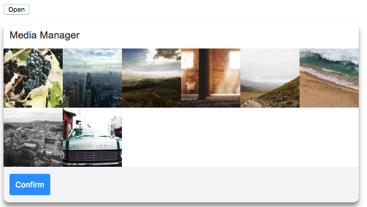

[](https://www.npmjs.com/package/simple-media-manager)
[](https://www.npmjs.com/package/simple-media-manager)
# Media Manager
Plain javascript media selector.

## Preview


## Installation
```bash
npm i simple-media-manager
// OR
yarn add simple-media-manager
```

## Usage
### Html
```html
<section class="app"></section>
<button id="selectImages">Open</button>
```
### Javascript
```js
import MediaManager from 'simple-media-manager'
import 'simple-media-manager/src/media-manager.sass'

const mediaManager = new MediaManager()

mediaManager.init({
  elements: {
    wrapper: document.querySelector('.wrapper')
  },
  source: {
    paths: ['https://unsplash.it/100/100?random', 'https://unsplash.it/100/100?random']
  },
  events: {
    // Fires when the user presses "Confirm".  The callback receives an array with the paths of all selected items.
    onConfirm: selectedPaths => {
      console.log(selectedPaths)
    },
    // Fires when the file input field fires a "change" event. The callback receives the event object
    onFileSelectionChanged: changeEvent => {
      console.log(changeEvent)
    },
    // Fires when the user presses "Cancel".
    onCancel: () => {
      console.log('Closed media manager popup')
    },
  }
})

// Toggle media manager when the button is clicked.
document.querySelector('#selectImages').addEventListener('click', () => {
  mediaManager.toggle()
})
```
### Styles
If you prefer importing the styles in a separate sass file use the following import statement.
```sass
@import "~simple-media-manager/src/media-manager"
```

## Development
1: [Fork the repository](https://help.github.com/articles/fork-a-repo/)  
2: Install the dependencies
```bash
npm install
// or
yarn install
```
3: start webpack
```bash
npm run dev
// or
yarn dev
```

## Stack
- Yarn
- Webpack
    - babel-loader
    - css-loader
    - sass-loader