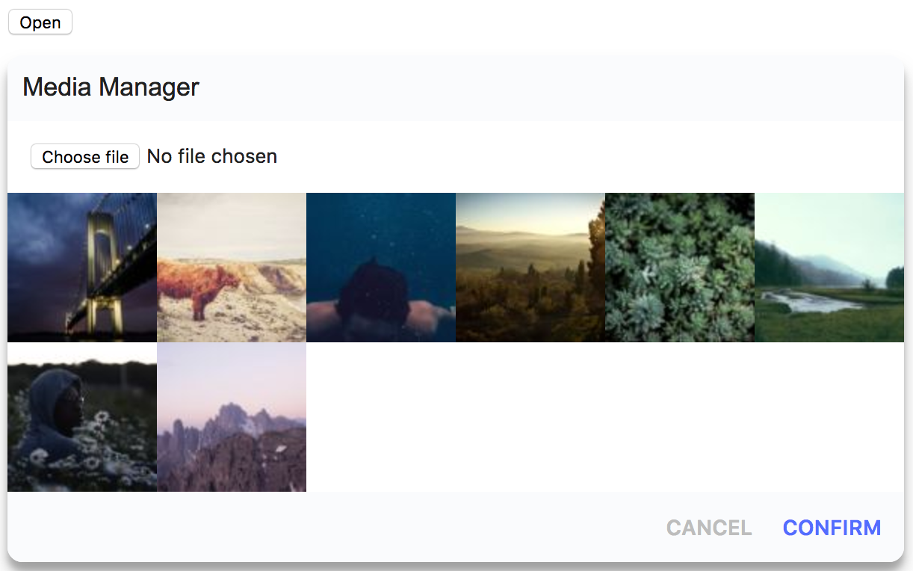

# Media Manager
Plain javascript media selector.

## Preview


## Usage
### html
```html
<section class="app"></section>
<button id="selectImages">Open</button>
```
### Javascript
```js
import { init } from './media-manager'
import './manager.sass'

init({
  elements: {
    toggleElement: document.querySelector('#selectImages'),
    wrapper: document.querySelector('.app')
  },
  source: {
    paths: ['https://unsplash.it/100/100?random&v=1', 'https://unsplash.it/100/100?random&v=2', 'https://unsplash.it/100/100?random&v=3', 'https://unsplash.it/100/100?random&v=4', 'https://unsplash.it/100/100?random&v=5', 'https://unsplash.it/100/100?random&v=6', 'https://unsplash.it/100/100?random&v=7', 'https://unsplash.it/100/100?random&v=8']
  },
  events: {
    // Fires when the user presses "Confirm".  The callback receives an array with the paths of all selected items.
    onConfirm: selectedPaths => {
      console.log(selectedPaths)
    },
    // Fires when the file input field fires a "change" event. The callback receives the event object
    onFileSelectionChanged: changeEvent => {
      console.log(changeEvent)
    }
  }
})
```
### Styles
If you prefer importing the styles in a separate sass file use the following import statement.
```sass
@import "media-manager.sass"
```

## Development
1: [Fork the repository](https://help.github.com/articles/fork-a-repo/)  
2: Install the dependencies
```bash
yarn install
// or
npm install
```
3: start webpack
```bash
yarn dev
```

## Stack
- Yarn
- Webpack
    - babel-loader
    - css-loader
    - sass-loader